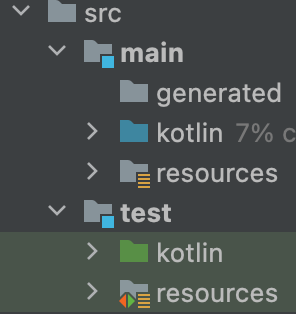
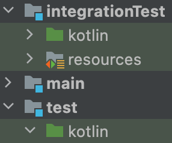

Gradle에서는 모듈 내에서도 소스셋을 나누어 사용할 수 있다. Intellij를 사용했을 때는 기본적으로는 다음과 같이 `main`, `test` 두 가지의 source set이 디폴트로 주어지지만, 상황에 따라 여분의 소스셋을 추가하고 싶을 때도 있다.



나는 유닛 테스트와 통합 테스트를 서로 다른 소스셋으로 구분하고 싶어서 기존의 `test`는 그대로 둔 채로 `integrationTest`라는 소스셋을 새로 추가했다. `build.gradle.kts`에서 아래와 같이 새로운 소스셋을 추가할 수 있다.

```kotlin
// Create a new sourceSet for integration tests
sourceSets {
    create("integrationTest") {
        java {
            compileClasspath += main.get().output + test.get().output
            runtimeClasspath += main.get().output + test.get().output
            srcDir("src/integrationTest/kotlin")
        }
    }
}

val integrationTestImplementation by configurations.getting {
    extendsFrom(configurations.testImplementation.get())
}

configurations["integrationTestRuntimeOnly"].extendsFrom(configurations.testRuntimeOnly.get())
```

여기서 주목할 만한 부분은 `classpath`를 설정하는 부분이다. 기존에 테스트를 작성할 때는 별도의 설정 없이 `main` 소스셋의 클래스들을 가져다 사용할 수 있었다. 이는 `test` 소스셋에서 `main`의 클래스패스를 참조하기 때문에 그렇다. 마찬가지로 `integrationTest`에서도 테스트를 위한 디펜던시들에 접근해야 하기 때문에 `test`의 빌드 결과를 새로운 소스셋의 클래스패스에 추가해주었다.

[공식 문서](https://docs.gradle.org/current/dsl/org.gradle.api.tasks.SourceSetOutput.html)에서 SourceSet의 output에 대한 설명을 찾을 수 있다.

> A collection of all output directories (compiled classes, processed resources, etc.) - notice that SourceSetOutput extends FileCollection.

여기까지 작성했다면 IDE의 파일 트리에 새로운 소스셋이 추가된 것을 확인할 수 있다. 그런데 Intellij가 해당 소스셋을 테스트 소스셋으로 인식하지 않는다.

이를 위해서는 idea 플러그인을 추가하고, `testSourceDirs`에 새로 추가한 소스셋을 등록하면 된다.

```kotlin
plugins {
    idea
}

// Register integrationTest sourceSet as a test sourceSet.
idea.module {
    val testSources = testSourceDirs
    testSources.addAll(project.sourceSets.getByName("integrationTest").java.srcDirs)
    // This line is redundant, but I just keep it as a reference.
    testSources.addAll(project.sourceSets.getByName("integrationTest").resources.srcDirs)
    testSourceDirs = testSources
}
```



마지막으로 해결해야 하는 문제는 새로 만든 소스셋에서 main이 아닌 다른 소스셋(가령 test)의 코드를 가져다쓸 수 있게 하는 것이다. 지금 이대로 사용할 경우 유닛 테스트에서 만든 테스트 데이터를 `integrationTest` 소스셋에서는 사용할 수 없다.

```
task("integrationTest", Test::class) {
    testClassesDirs = sourceSets["integrationTest"].output
    classpath = sourceSets["integrationTest"].runtimeClasspath
}


val integrationTestImplementation: Configuration by configurations.getting {
    extendsFrom(configurations.testImplementation.get())
}

configurations {
    getByName("integrationTestRuntimeOnly") {
        extendsFrom(configurations.testRuntimeOnly.get())
    }
}
```

### References

- https://docs.gradle.org/current/userguide/java_testing.html#sec:configuring_java_integration_tests
- https://rio-kim.github.io/testing/2017/12/20/gradle_test_sourceset_config/
