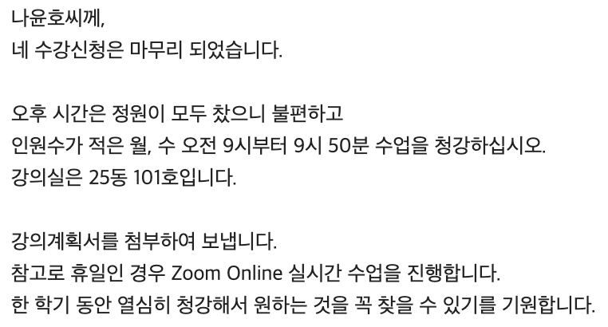

3월 초부터 대학교에서 미적분학 수업을 청강하고 있다.

어쩌다가 청강을 하게 됐는지, 소감은 어떤지 짧게 글을 써보려고 한다.

## 이유

내가 다닌 고등학교는 대학 진학을 목표로 하지 않는 고등학교라 수학에 대해 배울 수 있는 기회가 적었다.

그래도 지금까지의 과거를 돌아보면, 우연하게 수학과 연을 맺게 된 경우가 많았다.

동아리 활동에서는 옴니휠 로봇을 돌리기 위해 삼각 함수와 대수를 활용했고, 일을 시작하고 나서는 우연히 렌더링 파이프라인과 관련된 작업을 하면서 벡터와 행렬 등 조금 더 심화적인 선형대수를 활용했다.

그리고 나서는 AI 붐이 일어서 미적분이나 통계적 방법론들을 실제로 활용하는 사례들을 많이 보았던 것 같다.

그래서 나는 수학을 '추상화의 학문', 혹은 '모델링의 학문'이라고 생각한다.

복잡한 세계의 상태나 상호작용을 알파벳 몇 개와 기호 몇 개로 표기할 수 있다. 그 과정에서 추상화로 인해 디테일을 잃어버리기도 하지만, 요소들간의 관계는 더 명료해진다.

학교에서 수학을 배울 때 우리는 '이걸 어디다가 써먹어?' 같은 생각을 하곤 한다. 하지만 나는 운이 좋게도 수학이 긴밀하게 세상과 연결되어 있다는 걸 느낄 수 있었던 것 같다.

수학이 그리도 좋았지만 제대로 배워볼 기회는 없었다. 똑같은 전공 서적을 가지고 하더라도 혼자 공부를 하거나 Coursera 같은 플랫폼을 사용하는 것과 실제 대학교에서 강의를 들어보는 건 큰 차이가 있을 거라고 생각했다.

그래서 4개월 전에 한 번 청강을 신청해볼까 생각이 들었고, 다행히 교수님께서 허락해주셔서 지금은 아침마다 열심히 학교에서 강의를 듣고 있다.

## 과정

처음 청강에 대해서 생각하게 된 계기는, 지인 중 한 분이 유튜브에서 '전과자'라는 컨텐츠 공유해주고 난 후였다.

간단히 요약하자면 출연자가 여러 대학교에 다양한 학과를 경험하면서 그 학과는 어떤 것을 배우는 곳이고, 강의는 어떤 식으로 진행되는지 소개하는 컨텐츠라고 할 수 있겠다.

항상 대학 교육에 대한 궁금증이나 갈망은 있었지만, 딱히 학위를 원한 것은 아니었고 그걸 위해 1년 넘는 시간과 돈을 투자하는 건 리스크가 너무 크다고 생각했기 때문에 실행으로 옮기지는 못했다.

그런데 수학과 편을 보고 나서, 한 번 강의 분위기를 경험해보면 좀 더 명료해질 것 같아서 (당시에는 일을 쉬고 있었고, 재취업 뿐만 아니라 대학 진학 등 다양한 옵션을 고려하고 있었다) 청강에 대해 알아보기 시작했다.

인터넷으로 여러 정보들을 수집했지만, 대부분이 대학교 내에서 다른 과의 수업을 청강하는 경우였고, 나처럼 관계없는 일반인이 청강을 들었다는 얘기는 찾아보기가 어려웠다.

결국 부딫혀봐야 했고, 여러 대학교의 수학과 교수님들께 메일을 돌리기 시작했다.

> 
>  
> 열심히 썼다...

처음 몇 개의 답변은 거절이었다.

어느 정도는 이해할만한 것이 학생들은 입시라는 고된 과정을 거쳐 학교에 들어간 것일텐데, 교수님들 입장에서도 학생도 아닌 일반인이 청강을 할 수 있게 한다는 건 부담이 될 수 있겠다는 생각이 들었다.

그래도 메일을 좀 더 다듬고 시도를 거듭한 끝에..

> 

교수님 한 분께 허락을 받았다.

사실은 딱 한 번 정도면 괜찮겠다 싶어서 그렇게 말씀을 드렸는데, 한 학기동안 열심히 수강하라는 말씀에 (감사합니다..) 열심히 다니고 있는 중이다.

## 소감

일단 일을 벌려놓는게 중요하다는 생각이 들었다. 사실 잘 모르는 분에게 메일을 날리거나 연락을 하는게 super I 인 나에게는 어려운 일이었다. 그래도 최근에 빠른 실행이 중요하다는 걸 좀 느껴서 밑져야 본전이라는 생각으로 메일을 쓰고, 던졌다.

내가 행동하지 않고 그냥 생각만 하고 있었다면 지금 이런 이야기를 풀어놓지도 못했을거다. 역시 할까/말까 하는 고민보다는 어떻게 해야하는가를 고민하는게 훨씬 생산적이다.

강의 내용에 대해 얘기해보자면.. 가장 먼저 느꼈던 건, 고등학교에서 배우는 수학에 비해 훨씬 더 엄밀하다는 점이다.

어떤 증명이나 정리를 이야기할 때, 어떤 변수가 실수인지, 정수인지, 그리고 어떤 함수의 정의역과 공역이 어디인지를 항상 먼저 서술해야 한다.

그렇지만 때로는 맥락에 따라, (가령, 수열을 이야기할 때 $a_n$에서 n은 일반적으로 $n \in \mathbb{N}$ 혹은 $n \in \mathbb{N_0}$) 혹은 어떤 '약속'을 하나 해서 (가령, "이제부터 서술할 모든 정리나 증명에서 함수 f는 0을 포함하는 열린 구간 ${I} \rightarrow \mathbb{R}$ 이라 합시다.") 생략하는 경우도 있던 것 같다. 수학은 엄격하고 엄밀한 학문이라고 생각했는데, 이런 부분에서 또 재미가 있었다.

그리고 기본기가 부족하다고 많이 느꼈다. 처음엔 지수나 로그의 특성, 합성함수의 미분법, 적분같은 개념도 익숙하지가 않아서 따로 검색해가면서 공부해야 했다.

문제풀이나 증명에서 종종 항등식을 사용해 식을 다른 꼴로 변형하고는 하는데 (가령, $\forall n \in \mathbb{N}, \frac{1}{n(n+1)} = \frac{1}{n} - \frac{1}{n+1}$) 이런 항등식이나 기법을 활용하는게 익숙하지 않아서 중간중간 강의를 따라가는데 어려움이 있었다. 이런 것들은 나중에 혹시 도움이 될까 따로 [글로 정리하고 있다.](/math/math-techniques)

마지막으로 느꼈던 건, 진도를 나가는 속도가 정말 빠르다. 적어도 내 기준에서는 그렇다.

그런데 그래서 좋다. 혼자 했다면 3개월은 걸렸을 것을, 한달 정도만에 끝내니까 훨씬 밀도있게 공부하는 느낌이 든다. 혼자 공부하면서도 이렇게 빡세게 할 수 있다면 좋을텐데.

이렇게 빠르게 진행을 하다보니 상대적으로 중요하지 않은 부분에 대해서는 '그냥 그렇다고 하자'라고 넘어가는 경우가 생겼다. '안 좋은 거 아냐?'라고 생각할 수 있는데, 이거에 대한 얘기를 좀 해보겠다. 

나는 중간에 무언가 걸리는 게 있으면, 그게 해결될 때까지 붙잡고 있는 편이다.

경우에 따라 그런게 필요할지도 모르겠다. 그런데 그런 방식으로는 멀리 가기 어렵다는 걸 느꼈다. 때로는 전체 그림을 보고 나서 부분이 이해가 되는 경우도 있다.

이건 내 본업인 개발에서도 통용되는 이야기같다. 어떤 기술이나 개념을 쓰고자 할 때 어느 정도의 이해는 필수적이지만, 내가 그 기술의 모든 걸 다 이해할 필요는 없다. '멀리 가기 위해서는' 말이다. 기회 비용을 따졌을 때 1개의 기술을 깊게 파는 동안에 10개의 기술을 얕게나마 이해할 수 있는 기회를 놓치는 거니까.. 10개를 알고 1개를 살펴보면 더 이해가 쉬울 수도 있고.

쓰다보니 소감이 너무 길어졌는데, 요약하면

> - 관심가는게 있으면 일단 뭐든 시도해보자.  
> - 수학 재밌다.  
> - 모든걸 알려고 하진 말자. 멀리 가야 한다.  

업데이트 있으면 또 올리겠음.