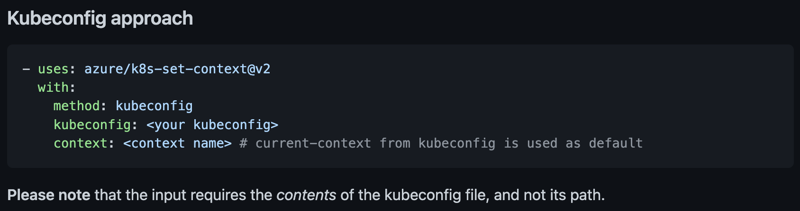

GitHub Actions를 사용해 배포 스크립트를 작성하다가 kubeconfig 파일에 관한 부분이 헷갈려 정리해보았다.

### What is kubeconfig

kubeconfig 파일은 클러스터, 유저, 네임스페이스, 인증 등 \**클러스터 접근*에 대한 정보를 담고 있는 파일이다.

### Where is it

기본적으로는 `$HOME/.kube/config`에 위치한다. 명령을 실행할 때는 디폴트로 이 파일을 사용하고, `KUBECONFIG` 환경 변수를 사용하거나 `--kubeconfig` 플래그를 사용해 직접 명시할 수 있다.

### How to use it (in deployment)

GitHub Actions를 이용해서 쿠버네티스에 배포를 하려면 마찬가지로 클러스터에 대한 접속 정보가 필요하기 때문에 이를 위해서 kubeconfig를 사용한다. 어떤 액션을 사용하는지는 자유겠지만, 나는 [k8s-set-context](https://github.com/Azure/k8s-set-context)라는 액션을 사용하기로 했다.



문서를 보면 kubeconfig 파일의 **내용**이 들어가야 한다고 적혀있다. 그런데, 이게 Azure의 쿠버네티스 클러스터 서비스인 AKS 내용만 있어서 구체적으로 어떤 내용이 들어가야 하는지 몰랐다.

방법은 사실 허탈할 정도로 간단하다. 다음과 같이 kubeconfig 파일의 내용을 복사한 다음, GitHub 설정에 secret으로 등록하고 사용하면 된다.

```
cat ~/.kube/config | pbcopy
```

경우에 따라 base64 인코딩이 필요하기도 한데, 이럴 때는 쉘에 base64 유틸이 내장되어 있으니 이를 사용하면 된다.

```
cat ~/.kube/config | base64 | pbcopy
```
